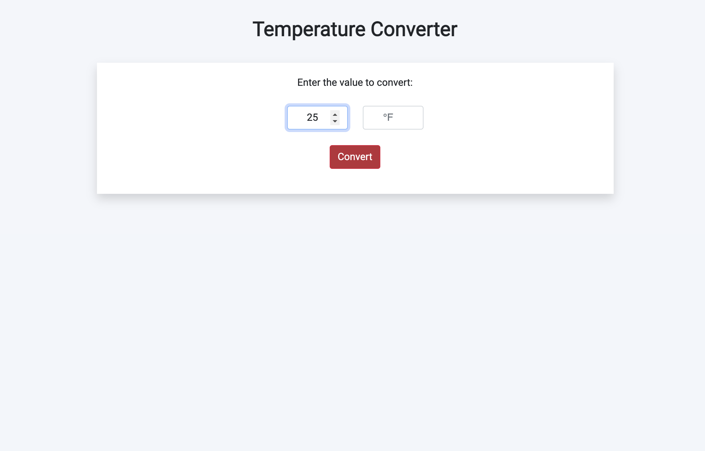

# Temperature-Conversion

This Vanilla Javascript app lets the user calculate the temperature from Celsius to Fahrenheit or vice versa. I created it to practice some basic javascript skills.

# Usage

# Future-Contributions

Some future work needed to refrain user from entering a number in input both boxes.

## Questions

GitHub: https://github.com/Alexandra-Hionis  
Email: Alexandra.hionis@gmail.com  
